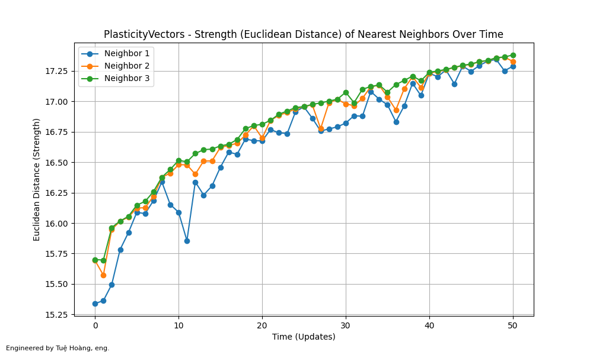
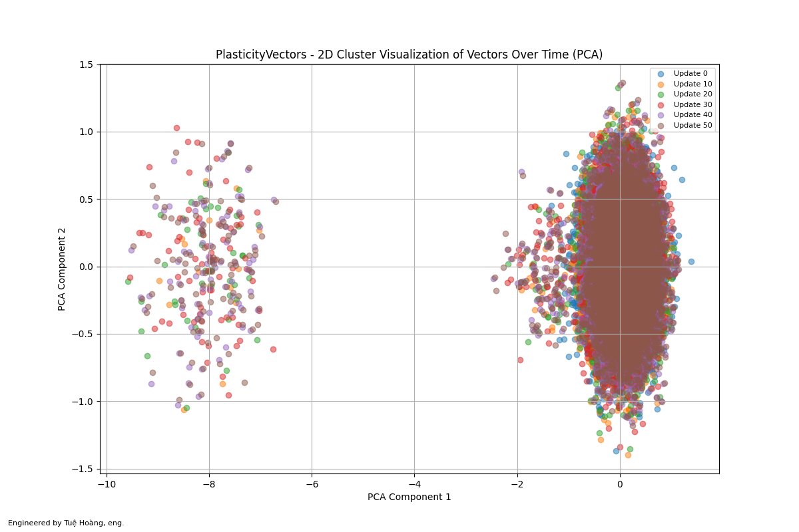
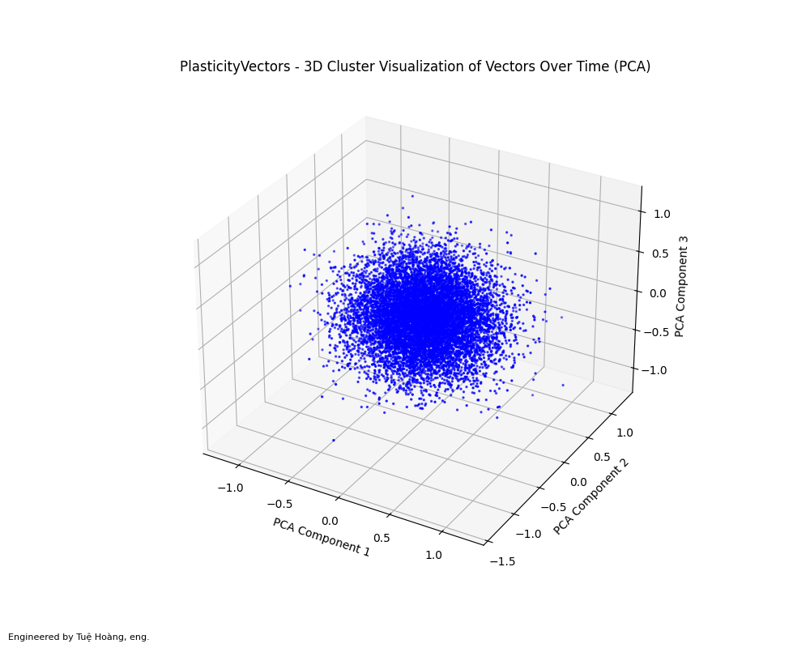
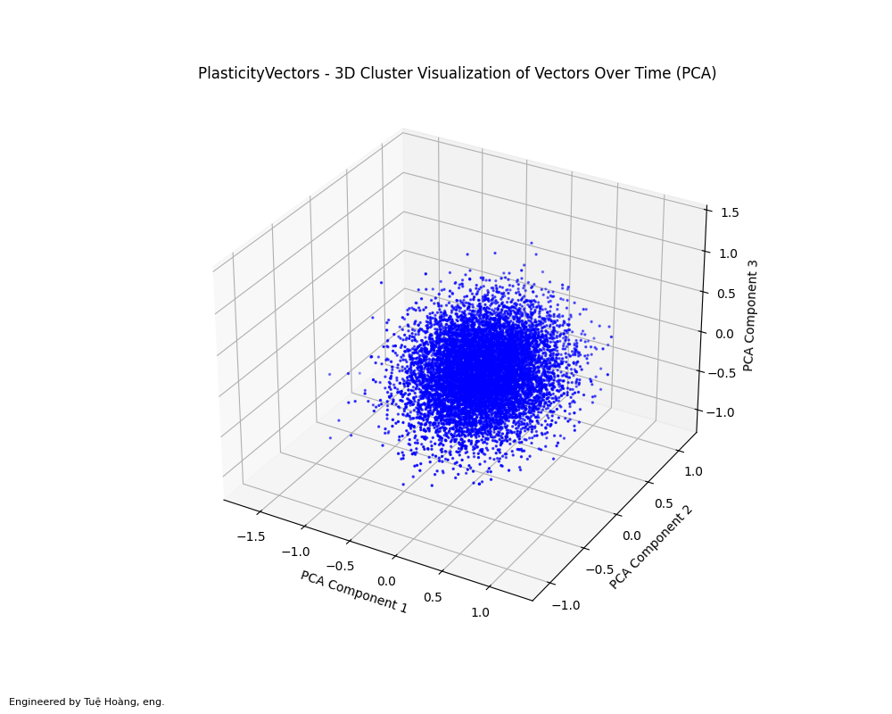
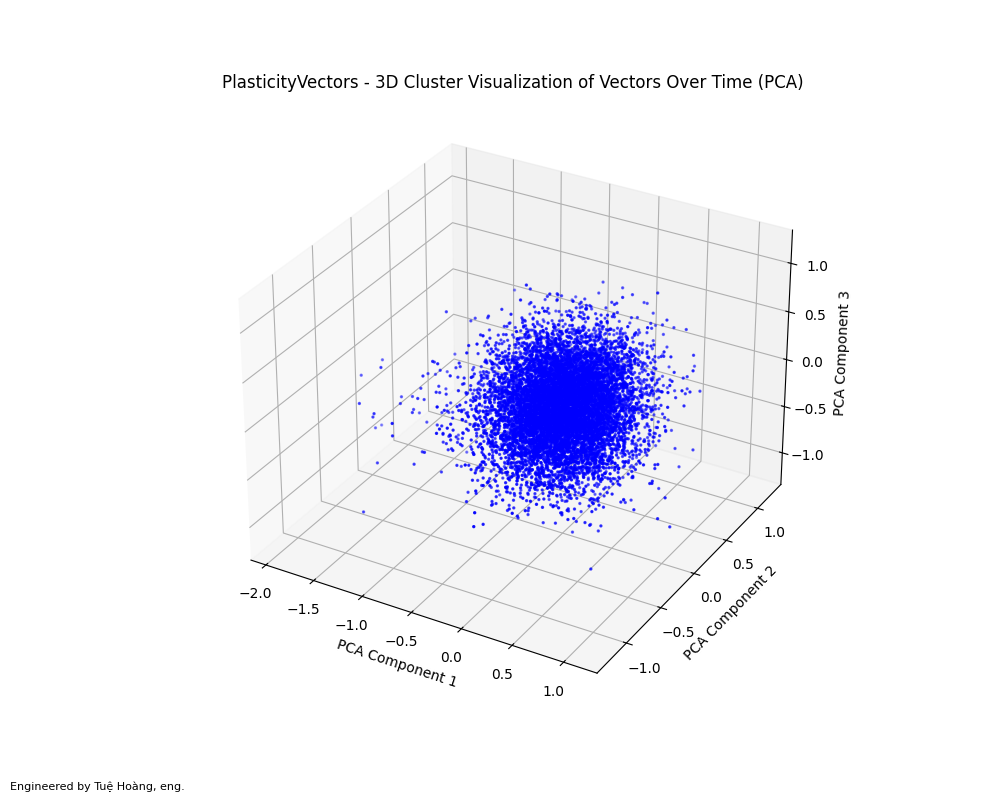
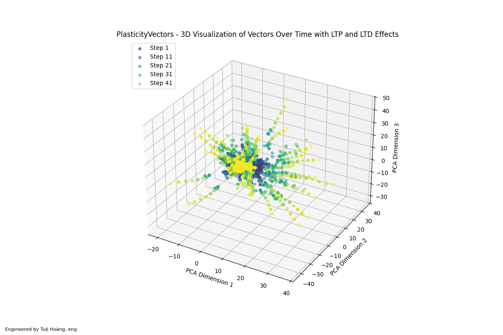

# PlasticityVectors: Exploring LTP and LTD with FAISS for Adaptive Clusters

- Dare to Dream
- Inspire Bold Leadership
- Embrace Diversity in Thought and Innovation
- Explore together & unlock the world's knowledge

--------------------------------------

This POC presents an approach to modeling neuroplasticity in artificial neural systems by integrating FAISS with Long-Term Potentiation (LTP) and Long-Term Depression (LTD). FAISS, a high-efficiency library for similarity search and clustering in high-dimensional spaces, manages vector-based representations to simulate dynamic neural interactions within clusters. These interactions reflect the biological processes of synaptic adaptation.

Inspired by Canadian neuropsychologist Donald Hebb that "cells that fire together, wire together," this framework uses LTP to mimic synaptic strengthening, reinforcing clusters when similarity thresholds are surpassed. Conversely, LTD embodies the idea that "cells that fire out of sync, lose their link," weakening underperforming clusters to simulate synaptic pruning. Together, LTP and LTD enable clusters to evolve over time, dynamically adapting based on vector interactions and simulating the plasticity inherent in biological brains.

The FAISS’s efficient clustering and indexing capabilities of this system allow for rapid updates to vector relationships, enabling real-time simulation of evolving cluster dynamics. By grouping vectors and calculating similarity-based interactions, this approach creates a flexible and scalable system that mirrors the balance of learning and adaptation found in neuroplasticity.

Simulation results, visualized through time-evolving plots of cluster strengths, demonstrate how vector connections adapt in response to changing conditions. This approach highlights FAISS not only as a powerful tool for efficient similarity search but also as a framework for exploring learning, memory, and adaptation in AI.

By integrating FAISS with biologically inspired mechanisms like LTP and LTD, this methodology provides a scalable and dynamic framework for understanding the relationship between high-dimensional vector spaces and neuroplasticity. It opens pathways for advancements in machine learning, cognitive modeling, and adaptive AI systems, bridging the gap between biological principles and AI.

-----------------------------------------------

The Elliptical Shape: The oval shape typically indicates a correlation between two dimensions in the PCA space. This means that the vectors in each cluster have certain dimensions that are more highly correlated with each other, forming a group that stretches more in one direction (as opposed to being circular or perfectly spread out).

- For the cluster near 0, the vectors might be aligned in such a way that their similarities due to stronger LTP effects in the original high-dimensional space are reflected as an elongated oval in the 2D PCA projection.

- For the cluster at -8, the spread or elongation due to stronger LTD effects, which could have caused a larger variation in the vectors' values, leading to a more elongated shape.

-----------------------------------------------

The Clustering: Note certain regions of the plot with a higher concentration of data points (denser clusters), those represent vectors that have been influenced similarly over time (e.g., vectors that underwent LTP).

The Spreading: Note the points are spread out in some regions of the 3D space, this indicates that LTD was applied to those vectors, causing them to become more distinct from each other.

Finally, Dynamics Over Time: While the plot shows the final distribution after all updates, tracking the changes in neighbor distances (over time) can reveal how the relationship between the query vector and its neighbors evolves with each plasticity update.

In summary, the 3D plot provides a visual representation of how the vectors in the dataset undergo plasticity processes (LTP and LTD), showing their evolution and clustering in a reduced 3D space. It helps to see how vectors move relative to each other and how they become more or less similar depending on their interactions with the query vector.

------------------------------------------

Finally, this colourful 3D plot provides a view of how the clusters of vectors (represented by different groups of points) move and change in the 3D space over the course of the simulation. This captures the dynamic nature of the vectors as they interact and adapt, influenced by LTP and LTD effects. Additionally, the colour gradient helps visualize the time progression, making it easier to see how the vectors evolve at different stages of the simulation, reflecting the Hebbian principle that "cells that fire together, wire together." 
